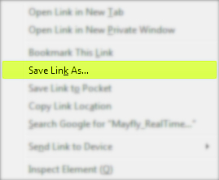

## Introduction  

This document outlines what you will need to build a Continuous Temperature Logger with the [EnviroDIY Mayfly data logger](https://www.envirodiy.org/mayfly/).  It is meant to keep the information as simple and clear for new users, but those with more experience may want to expand on the application.  
  
  
  
Originally set up as a low cost experiment to evaluate possible uses for Citizen Science and Educators, the example data logger used for this document was assembled with off-the-shelf-components and has been [deployed](https://monitormywatershed.org/sites/STWTR2/) since February 16th, 2020.  
  
It does not utilize the Xbee cellular module which means that it will not offer real-time data via the [Monitor My Watershed](https://monitormywatershed.org/) portal. All data is saved to the on-board micro-SD card and uploaded manually.  

Use of the [Arduino Desktop IDE](https://www.arduino.cc/en/Main/Software) will be needed to compile and upload the [sketches](https://www.arduino.cc/en/Tutorial/Sketch) to the Mayfly. While the process is fairly straight-forward and all of the sketches are provided for you to use and modify, you may want to take some time to explore the Arduino website as well as the EnviroDIY GitHub repository to better understand the concepts explained in this document.    
  
**TABLE OF CONTENTS**  
  
- [Introduction](#introduction)
- [Hardware](#hardware)
  * [Starter Kit](#starter-kit)
  * [Real-time Clock Battery](#real-time-clock-battery)
  * [3.7 Volt Lithium Polymer Battery](#37-volt-lithium-polymer-battery)
  * [OneWire Temperature Sensor](#onewire-temperature-sensor)
- [Setting up the Arduino Desktop IDE Software](#setting-up-the-arduino-desktop-ide-software)
  * [Adding the EnviroDIY board to Arduino](#adding-the-envirodiy-board-to-arduino)
  * [Connecting to a Computer](#connecting-to-a-computer)
- [Compiling and Uploading Code](#compiling-and-uploading-code)
  * [Setting the date and time on the Real-time clock](#setting-the-date-and-time-on-the-real-time-clock)
  * [Address Discovery of OneWire Temperature Sensor](#address-discovery-of-onewire-temperature-sensor)
  * [Testing the OneWire Temperature Sensor](#testing-the-onewire-temperature-sensor)
  * [Continuous Temperature Logging Code](#continuous-temperature-logging-code)
- [Field Installation](#field-installation)
- [MonitorMyWatershed.org](#monitormywatershedorg)
  * [Creating an account](#creating-an-account)
  * [Registering a Sensor Station](#registering-a-sensor-station)
  * [Customizing Header Information & Uploading the CSV Sensor Data](#customizing-header-information---uploading-the-csv-sensor-data)
- [Definitions](#definitions)
  
## Hardware  

### Starter Kit  
The [Mayfly Starter Kit](https://www.envirodiy.org/mayfly/hardware/starter-kit/) supplies you with the essential components for building your own data logger.  
  
From the EnviroDIY website:
  
> "The EnviroDIY Mayfly Data Logger is a powerful, user-programmable microprocessor board that is fully compatible with the Arduino IDE software."

> "The memory card socket, RTC, and solar charging features make it very easy to use this board for data logging and low-power operation. But it can also be used by itself, or with a wide variety of devices and accessories.  The Mayfly can be powered by a 3.7v lithium battery or through the microUSB port."  
  
  
  
Stroud Water Research offers this kit through [Amazon](https://www.amazon.com/EnviroDIY-Mayfly-Arduino-Compatible-Starter/dp/B01FCVALDW/ref=sr_1_2?keywords=Stroud+Water+Research+Center&qid=1585584911&sr=8-2) for about $90 plus shipping cost.    
  
The Starter Kit includes the following items:  

  * EnviroDIY Mayfly Data Logger Board  
  * Waterproof enclosure with clear lid  
  * microUSB programming cable (1-meter long)  
  * 2 [Grove](http://wiki.seeedstudio.com/Grove_System/) cables (20cm long)  
  * 4GB [microSD](https://en.wikipedia.org/wiki/SD_card) memory card with SD card size adapter  
  * 0.5 watt solar panel with [JST connector](https://en.wikipedia.org/wiki/JST_connector)  
  * Mayfly micro-SD vertical adapter board  

Some additional items will need to be purchased separately from the Starter Kit to make the logger fully operational:  

### Real-time Clock Battery  
  
The [Real-time clock](https://en.wikipedia.org/wiki/Real-time_clock) (RTC) battery is a small 3 volt button cell battery (like a watch battery) that helps the Mayfly retain the data and time when external power (Li-Po battery or USB) has been removed from the board. They are fairly common and can be purchased from many retailers (on-line, grocery stores, drug stores, etc.).  
  

  
Install the CR1220 battery for the real-time clock on your Mayfly board by sliding it into the circular metal battery holder located on the board. Make sure that the orientation of the polarity (+ and -) is correct so the board is not damaged.  
  
### 3.7 Volt Lithium Polymer Battery  
  
There are many different types of batteries available for use. It is important to select a battery with enough storage capacity to operate for a period of time without being charged or with very little opportunity to charge (not unlike your phone). This is important for installation sites that are well shaded or receive partial sunlight during the day (forests, shaded slopes or valleys).  
  

  
Battery manufactures use a rating of `mAh` or milliampere-hours (A smart-phone battery usually has between 2500 and 4000 milliampere-hours of electric capacity). The temperature logger that this document is based on is using a 1200 mAh battery and is located in an area that receives a  lot of direct sunlight. If you plan to install the logger in a location with less available light, you may want to choose a higher mAh rating to ensure consistent power between charging periods.  
  
The battery must also have a 2 pin [JST-PH](https://en.wikipedia.org/wiki/JST_connector) connector. This is a small (2mm) connector with a key or ridge on one side that mates with the connector on the Mayfly.   
  

  
**It is important to look at the polarity (positive & negative) of the wires coming from the battery in relation to the polarity on the Mayfly board.**  
  
Not all manufacturers configure their batteries the same way and you might receive a battery that is wired in reverse from the way the Mayfly is set up.
  
Each battery connector on the Mayfly will have a `plus (+)` and `minus (-)` symbol printed on the circuit board. The battery will have two wires attached to the connector, a `positive (red)` and a `negative (black)`. These must match up when connecting the battery to the Mayfly `(red + & black -)`. If your battery does not match up you will need to change the wires so they do.  
  

  
**CONNECTING A BATTERY WITH INCORRECT POLARITY CAN BE HAZARDOUS TO YOUR WELL BEING AND TO THE MAYFLY**    
  
The Li-Po battery is not immediately required for setting up the Mayfly board but it will be needed when you want to run the board without being connected to your computer (i.e. in the field).  

### OneWire Temperature Sensor  
  
Seeed Studio offers a [OneWire temperature sensor](https://www.seeedstudio.com/One-Wire-Temperature-Sensor-p-1235.html) that comes complete with a [Grove](http://wiki.seeedstudio.com/Grove_System/) connector, making it very simple to connect and use the sensor with little to no modification.  
  
  
  
Each temperature sensor has a unique address to identify it.  Use the sketch in the "**Address Discovery of OneWire Temperature Sensor**" section to find the address of your sensor. Be sure to keep this number on hand when you get to compiling the code for temperature logging. 
  
If you are looking for additional information on the DS18B20 chip used in this sensor (to modify or build your own), [Last Minute Engineers](https://lastminuteengineers.com/ds18b20-arduino-tutorial/) has an article on interfacing with the Arduino that might be helpful.  
  
## Setting up the Arduino Desktop IDE Software    
  
Detailed information on installing the Arduino software can be found on the Arduino website.  You will need to [download](https://www.arduino.cc/en/main/software) `version 1.6.5 or greater`. 
  
Please read the instructions for the corresponding operating system you have installed:
  
  * [Windows](https://www.arduino.cc/en/Guide/Windows)  
  * [MacOS](https://www.arduino.cc/en/Guide/MacOSX)  
  * [Linux](https://www.arduino.cc/en/Guide/Linux)  
  * [Portable IDE](https://www.arduino.cc/en/Guide/PortableIDE) (Windows and Linux)   
  
There is an [introduction](https://www.arduino.cc/en/Guide/Introduction) on what Arduino is and why you would want to use it as well as many other resources available on the website.  

### Adding the EnviroDIY board to Arduino  

Before the Arduino IDE can use the Mayfly, we need to add some information to tell it a little about the specifics of the board.  
  
Start the Arduino software, then click on `File > Preferences` and paste the following URL into the box labeled `Additional Boards Manager URLs`:  

`https://raw.githubusercontent.com/EnviroDIY/Arduino_boards/master/package_EnviroDIY_index.json`  
  
  
  
Click the "`OK`" button to close this window and return to the main screen.  
  
You will need to select the Mayfly to make it the active board in the IDE  by going to `Tools > Board > Boards Manager` from the menu of the main screen. 
  
A new window will open and in the drop-down list on the top left of the screen `Type > Contributed`" and then type in  `EnviroDIY` In the search bar. 
  
You should see a search result for the `EnviroDIY ATmega Boards`. Click the "`Install`" button to complete your selection and click the "`Close`" button when it has finished.  
  
 
  
Now, from the `Tools > Board` menu in the main window of the IDE, select the `EnviroDIY Mayfly 1284P` from the list of available boards.
  
 
  
### Connecting to a Computer  
  
Follow the instructions in the [Sensor Station Manual](https://www.envirodiy.org/mayfly-sensor-station-manual/) on the EnviroDIY website to connect the Mayfly to your computer. (`Section 4.2.Connecting a Computer to the Mayfly Data Logger`)  
    
  * Attach the USB cable to the Mayfly and to the computer  
  * Turn on the Mayfly using the `off/on` switch  
  * Select the `COM Port` in the Arduino software under the menu `Tools > Port`  
  
  
  
  * Open the Serial Monitor to view the pre-loaded sketch that come with the Mayfly by pressing the `Serial Monitor` button, hold `Ctrl+Shift+M` or select `Tools > Serial Monitor` from the menu.  Make sure the "`baud`" rate option at the bottom right side of the window is set to "`9600`".
  
## Compiling and Uploading Code  
  
The following information will get the Mayfly set up for the temperature logging code that will run once the unit has been deployed in the field.  
  
In each of the three sections of code to follow, there will be a link to a sketch for the Arduino IDE. The link will open a web browser window to the repository on GitHub, where the sketch is hosted.  
  
You will need to look for the file that ends with the extension `.ino`. This is the sketch for the Arduino IDE.  

Use your mouse to `Right Click` on the file and select `Save Link As`.  
  
  
  
The Arduino IDE expects to have files in a folder with the same name. Once you have downloaded the file, create a folder with the same name of the file, minus the `.ino` extension and place the file in that folder (e.g. the file `Mayfly_RealTimeClock.ino` would be placed in a folder named `Mayfly_RealTimeClock`).  
  
The Arduino IDE creates a folder, usually in `Documents/Arduino/sketches`, for you to save your sketches. You do not have to save them here but it makes it easier to find them later and they will appear in the menu under `File > Sketchbook > sketches`.
  
### Setting the date and time on the Real-time clock    

One of the most important first steps that needs to be done is setting up the real-time clock (RTC) so that your time-stamps in your logger data are correct.

[Download](https://github.com/movingplaid/Mayfly_RealTimeClock) the code for setting the real-time clock and open it in the Arduino IDE. Don't forget to place the file in a folder with the same name as mentioned at the start of this section.   
  
This sketch is meant to be a simple as possible for the user, but if you do a search on the Internet, you will find several variations on how to do the same thing.
  
In this code, we are setting the time based on the time we compile the sketch. There will be a slight difference between the system time and the Mayfly time (about 10 seconds) due to the time it takes your computer to upload the sketch to the Mayfly.  
  
We do a second compile and upload AFTER commenting out the portion of the code that sets the time so that the next time you open the Serial Monitor or turn the Mayfly on, the time will not get reset to the compile time again.   
  
**NOTE:** It is helpful to understand that Arduino sketches contain two important sections. A `setup()` function and a `loop()` function.  The `setup()` function runs once when the board is powered on or when the reset button is pressed.  There is also a `loop()` function that runs continuously after the `setup()` function is finished and continues on until the board is powered off.   
  
Before compiling, you will need to install the following library:  
  
  * `RTClib`
  
In the Arduino software, go to `Tools > Manage Libraries` and type "`RTClib`" in the search bar and press "`Enter`" on your keyboard.  
  
  
  
Select the library named "`RTClib`" and click the "`Install`" button.   
  
Look at this line of code in the `setup()` function and make sure that it looks the same (this is where the sketch sets the time):
  
`rtc.adjust(DateTime(F(__DATE__),F(__TIME__)));`  
  
Compile and upload the sketch, by clicking the `Upload` button, hold `Crtl+U` or select `Sketch > Upload` from then menu.   
  
At this point, the time is set. The code sets the time in the `setup()` function and then continues to the `loop()` function where is prints out the time.  

Now, we want to change that line of code so that the time is NOT SET AGAIN in the `setup()` function. Use two slashes in front of the line of code so it looks like the following:  
  
`// rtc.adjust(DateTime(F(__DATE__),F(__TIME__)));`  
  
Compile and upload again by clicking the `Upload` button, hold `Crtl+U` or select `Sketch > Upload` from then menu.    

Open the Serial Monitor by pressing the `Serial Monitor` button, hold `Ctrl+Shift+M` or select `Tools > Serial Monitor` from the menu.  Make sure the "`baud`" rate option at the bottom right side of the window is set to "`9600`".
  

  
The Serial Monitor should output the date and time currently set on the RTC and you will not have to do this again unless you change the battery or you notice errors in you date-time stamp.

  

### Address Discovery of OneWire Temperature Sensor  
  
Before you can use the OneWire Temperature Sensor, you will need to find the specific address assigned to it. Each sensor has a unique address so that multiple sensors can be used at the same time.  
  
[Download](https://github.com/movingplaid/Mayfly_OneWireAddress) the code for the OneWire Device Address discovery and open it in the Arduino IDE.  Don't forget to place the file in a folder with the same name as mentioned at the start of this section.  
  
The following libraries are requires to compile this code:  
  
  * OneWire
  
In the Arduino software, go to `Tools > Manage Libraries` and type "`OneWire`" in the search bar and press "`Enter`" on your keyboard.  
  
Select the library named "`OneWire`" and click the "`Install`" button.   

Close the Library Manager window by clicking the "`Close`" button when finished.  
  
Plug the OneWire Temperature Sensor into the Grove port marked `D4-5` on the Mayfly board.  
  
Compile and Upload the sketch to the Mayfly by clicking the `Upload` button, hold `Crtl+U` or select `Sketch > Upload` from then menu.  

Open the Serial Monitor by pressing the `Serial Monitor` button, hold `Ctrl+Shift+M` or select `Tools > Serial Monitor` from the menu. Make sure the "`baud`" rate option at the bottom right side of the window is set to "`9600`".
  

  
The Serial Monitor should output a string of characters that is your sensors address. Write this address down or save it somewhere to access it later when using the OneWireExample or building the Temperature Logging Code.  

Example output from this sketch:  

`Start oneWireSearch.ino`

`0x28, 0x48, 0x98, 0xD6, 0x0B, 0x00, 0x00, 0x8A	// CRC OK`  
`Number of Devices Found: 1`

`End oneWireSearch.ino`

If you need to run the sketch again, press the "`reset`" button on the Mayfly or upload the sketch again.
  
### Testing the OneWire Temperature Sensor
  
To verify that your sensor has been correctly identified, you can run this simple sketch.  

[Download](https://github.com/movingplaid/Mayfly_OneWireExample) the code for the OneWire Example.  Don't forget to place the file in a folder with the same name as mentioned at the start of this section.  
 
Open the code in the Arduino software and search for the line:  

`DeviceAddress TempSensor = `   

Copy the DeviceAddress you found previously and paste it into your code between the curly braces {}.    
  
Example:  
  
`DeviceAddress TempSensor = { 0x28, 0x48, 0x98, 0xD6, 0x0B, 0x00, 0x00, 0x8A };`   

The following libraries are requires to compile this code:  
  
  * OneWire
  * DallasTemperature
  
In the Arduino software, go to `Tools > Manage Libraries` and type "`OneWire`" in the search bar and press "`Enter`" on your keyboard.  
  
Select the library named "`OneWire`" and click the "`Install`" button. 
  
Do the same for the DallasTemperature library. Type "`DallasTemperature`" in the search bar and press "`Enter`" on your keyboard.  
  
Select the library named "`DallasTemperature`" and click the "`Install`" button.  

Close the Library Manager window by clicking the "`Close`" button when finished.  

Plug the OneWire Temperature Sensor into the Grove port marked `D4-5` on the Mayfly board.  
  
Upload the sketch to the Mayfly by clicking the `Upload` button, hold `Crtl+U` or select `Sketch > Upload` from then menu.  

Open the Serial Monitor by pressing the `Serial Monitor` button, hold `Ctrl+Shift+M` or select `Tools > Serial Monitor` from the menu. Make sure the "`baud`" rate option at the bottom right side of the window is set to "`9600`".
  

  
The Serial Monitor should output the current temperature that the sensor is reading.  This is also helpful in conducting QC tests to determine how accurate your sensor is.  
  
  
  
### Continuous Temperature Logging Code  
  
Finally, this is the part where we get to the real world application of the Continuous Temperature Logger.  
  
**NOTE:** While it may appear to be a lot more code and more complex, there is very little you will have to change to get this running. The hard part has been done and you only need to add in your sensor address and configure the data header for the file that is saved to the SD card.  
  
The sketch for the Continuous Temperature Logger is currently set up to cycle through the following operations at one minute intervals:  
  
  * Wake up the Mayfly board
  * Get the current temperature from the sensor
  * Read the current voltage of the battery
  * Read the current temperature of the Mayfly
  * Write the information to the SD card
  * Go back to sleep (to conserve power)
  
[Download](https://github.com/movingplaid/Mayfly_TempProbeLogging) and open the Temperature Logging code from GitHub. Don't forget to place the file in a folder with the same name as mentioned at the start of this section.   
  
Look for the line of code that looks like this:  
  
`// Simple Header`  
`#define   DATA_HEADER "Date and Time ...` 
  
This is the header information for the values that will be written to the SD card.  For now, we will keep it as it is:  
  
  * Date and Time in UTC-5  
  * Temperature (of the Sensor)  
  * Battery voltage  
  * Temperature (of the Mayfly)  
 
If you do not plan to upload your data to MonitorMyWatershed, you can rename these values as you like, but the must stay in this order unless you make further changes to the sketch.  

**NOTE:** MonitorMyWatershed expects values to be in a specific order which is not covered in this section. Please refer to the section `Registering a Sensor Station` later in this document.  
  
You will need to edit the code to replace the DeviceAddress with the address discovered for your sensor (see `Address Discovery of OneWire Temperature Sensor`)  

Open the code in the Arduino software and search for the line:  

`DeviceAddress TempSensor = `   

Copy the DeviceAddress you found previously and paste it into your code between the curly braces {}.    
  
Example:  
  
`DeviceAddress TempSensor = { 0x28, 0x48, 0x98, 0xD6, 0x0B, 0x00, 0x00, 0x8A };`

The following libraries will need to be installed via the library manager found under `Tools > Manage Libraries`. 
  
  * OneWire 
  * Sodaq_DS3231  
  * Sodaq_PcInt
  * RTC_Timer  
  * DallasTemperature  
  
For each library you will need to do the following:  
  
In the Arduino IDE, go to `Tools > Manage Libraries` and type the name of the library in the search bar and press "`Enter`" on your keyboard.  
  
Select the library found and click the "`Install`" button.   
  
If you want to change the interval that the Mayfly wakes up to record data, search for the following line (in the `loop()` function):  
  
`if(currentminute % 1 == 0) {`  
  
You can change `currentminute % 1` to whatever value suits your needs.  
  
For testing purposes, it is convenient to have the time set low so you do not have to wait long for each reading.  In the field you may want to increase the time to 5 or 15 minutes, depending on how precise you want your data to be.  

Upload the sketch to the Mayfly by clicking the `Upload` button, hold `Crtl+U` or select `Sketch > Upload` from then menu.  

Open the Serial Monitor by pressing the `Serial Monitor` button, hold `Ctrl+Shift+M` or select `Tools > Serial Monitor` from the menu. Make sure the "`baud`" rate option at the bottom right side of the window is set to "`9600`".  
  
  

## Field Installation  
  
Location  
  
 
  
Mounting Hardware  
  
  
  
## MonitorMyWatershed.org  
  
### Creating an account  

`https://monitormywatershed.org/register/`   
  
 
  
### Registering a Sensor Station  
  
`https://monitormywatershed.org/sites/register/`
  
  
You will also need to edit the header information (DATA_HEADER) to match your individual site (see `Customizing Header Information & Uploading the CSV Sensor Data`).  
  
Example: 
  
`Sampling Feature UUID: [sampling feature UUID],,,\r\nSensor Name:,Maxim_DS18B20,EnviroDIY_Mayfly Data Logger,EnviroDIY_Mayfly Data Logger\r\nVariable Name:,Temperature_C,Battery_Voltage,Board_Temp_C\r\nResult Unit:,degreeCelsius,volt,degreeCelsius\r\nResult UUID:,[variable 1 UUID],[variable 1 UUID],[variable 1 UUID]\r\nDate and Time in UTC-5,Temperature,Battery voltage,Temperature` 

### Customizing Header Information & Uploading the CSV Sensor Data  
  
  `https://wikiwatershed.org/help/sensor-help/sharing-sensor-data/#sensor-data`  
    
    
    
## Definitions  

  * [JST](https://en.wikipedia.org/wiki/JST_connector) - JST connectors are electrical connectors manufactured to the design standards originally developed by J.S.T. Mfg. Co.  JST connectors are used in many types of products, and commonly used by electronics hobbyists and consumer products.   
  * [mAh](https://whatis.techtarget.com/definition/milliampere-hour-mAh) - A milliampere hour (mAh) is 1000th of an ampere hour ( Ah ). Both measures are commonly used to describe the energy charge that a battery will hold and how long a device will run before the battery needs recharging.    
  * [Sketch](https://www.arduino.cc/en/tutorial/sketch) - A sketch is the name that Arduino uses for a program. It's the unit of code that is uploaded to and run on an Arduino board.    
  * [Code](https://en.wikipedia.org/wiki/Source_code) - In computing, source code is any collection of code, possibly with comments, written using a human-readable programming language, usually as plain text.  
  * [IDE](https://en.wikipedia.org/wiki/Integrated_development_environment)  -An integrated development environment (IDE) is a software application that provides comprehensive facilities to computer programmers for software development. An IDE normally consists of at least a source code editor, build automation tools and a debugger.  
  * [Grove](http://wiki.seeedstudio.com/Grove_System/) - Grove is a modular, standardized connector prototyping system.    
  * [CSV](https://en.wikipedia.org/wiki/Comma-separated_values) - A comma-separated values (CSV) file is a delimited text file that uses a comma to separate values. Each line of the file is a data record. Each record consists of one or more fields, separated by commas.  
  * [Header](https://en.wikipedia.org/wiki/Header_(computing)) - In information technology, header refers to supplemental data placed at the beginning of a block of data being stored or transmitted. In data transmission, the data following the header is sometimes called the payload or body.   
  * [Compile](https://en.wikipedia.org/wiki/Compiler) - A compiler is a computer program that translates computer code written in one programming language (the source language) into another language (the target language).  
  * [Upload](https://www.arduino.cc/en/Guide/ArduinoUno) - When you upload a sketch, you're using the Arduino boot-loader, a small program that has been loaded on to the micro-controller on your board. It allows you to upload code without using any additional hardware.   
  * [Button Cell](https://en.wikipedia.org/wiki/Button_cell) - Also known as lithium coin battery, that is mainly used in high power devices such as key-less entry devices, glucose monitors, heart-rate monitors, and toys & games. 
    
## About Me  
  
I am a PA Master Naturalist and Citizen Scientist focusing on forests and watersheds. In addition to the volunteer work I do with watershed associations in Berks and Lancaster counties, I conduct monthly stream testing on Stillwater Run in Nolde Forest State Park where the Continuous Temperature Logger, used for this document, is located.  
  

