# Building a Continuous Temperature Logger  with the EnviroDIY Mayfly  
  
## Introduction  

This document outlines what you will need to build a Continuous Temperature Logger with the [EnviroDIY Mayfly Data Logger](https://www.envirodiy.org/mayfly/). This is a great EnviroDIY starter project and utilizes the Mayfly Data Logger and a OneWire Temperature Sensor. 
  
Many of the instructions to used in this document are based on the [EnviroDIY Mayfly Sensor Station Manual](https://www.envirodiy.org/mayfly-sensor-station-manual/) but you can adjust your set up based on your comfort level or budget. It is meant to be simple and clear for new users but those with more experience can adapt and improve on the set up and installation.
  
It does not utilize the [XBee](https://www.digi.com/xbee) cellular module which means that it will not offer real-time data via the [Monitor My Watershed](https://monitormywatershed.org/) portal. All data is saved to the on-board micro-SD card and can be uploaded manually if you choose to do so.  
  
<div style="page-break-after: always;"></div>  

**TABLE OF CONTENTS**  
 
- [Building a Continuous Temperature Logger  with the EnviroDIY Mayfly](#building-a-continuous-temperature-logger--with-the-envirodiy-mayfly)
  * [Introduction](#introduction)
  * [Hardware](#hardware)
    + [Starter Kit](#starter-kit)
    + [Real-time Clock Battery](#real-time-clock-battery)
    + [3.7 Volt Lithium Polymer Battery](#37-volt-lithium-polymer-battery)
    + [OneWire Temperature Sensor](#onewire-temperature-sensor)
    + [Additional Hardware](#additional-hardware)
    + [Putting it All Together](#putting-it-all-together)
  * [Setting up the Arduino Desktop IDE Software](#setting-up-the-arduino-desktop-ide-software)
    + [Download the Arduino IDE](#download-the-arduino-ide)
    + [Adding the EnviroDIY board to Arduino](#adding-the-envirodiy-board-to-arduino)
    + [Connecting to a Computer](#connecting-to-a-computer)
  * [Compiling and Uploading Code](#compiling-and-uploading-code)
    + [Setting the Date and Time on the Real-time clock](#setting-the-date-and-time-on-the-real-time-clock)
    + [Testing the OneWire Temperature Sensor](#testing-the-onewire-temperature-sensor)
    + [Continuous Temperature Logging Code](#continuous-temperature-logging-code)
  * [Quality Control](#quality-control)
  * [MonitorMyWatershed](#monitormywatershed)
    + [Creating an account](#creating-an-account)
    + [Registering a Site](#registering-a-site)
    + [Adding Sensors](#adding-sensors)
    + [Uploading Data](#uploading-data)
    + [Viewing Your Data](#viewing-your-data)
  * [Field Installation](#field-installation)
    + [Location](#location)
    + [Mounting Hardware and Installation](#mounting-hardware-and-installation)
  * [Conclusion](#conclusion)    

<div style="page-break-after: always;"></div>   

## Hardware  

### Starter Kit  
  
The [Mayfly Starter Kit](https://www.envirodiy.org/mayfly/hardware/starter-kit/) supplies you with the essential components for building your own data logger. Stroud Water Research offers this kit through [Amazon](https://www.amazon.com/EnviroDIY-Mayfly-Arduino-Compatible-Starter/dp/B01FCVALDW/ref=sr_1_2?keywords=Stroud+Water+Research+Center&qid=1585584911&sr=8-2) for about $90 plus shipping cost.    
  
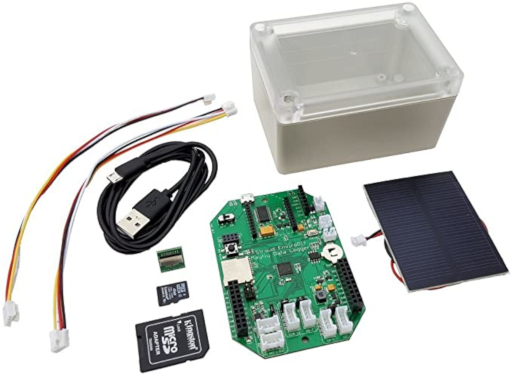  
  
The Starter Kit includes the following items:  

  * EnviroDIY Mayfly Data Logger Board  
  * Waterproof enclosure with clear lid  
  * microUSB programming cable (1-meter long)  
  * 2 [Grove](http://wiki.seeedstudio.com/Grove_System/) cables (20cm long)  
  * 4GB [micro-SD](https://en.wikipedia.org/wiki/SD_card) memory card with SD card size adapter  
  * 0.5 watt solar panel with [JST connector](https://en.wikipedia.org/wiki/JST_connector)  
  * Mayfly micro-SD vertical adapter board  

Some additional items will need to be purchased separately from the Starter Kit to make this example logger fully operational:  

### Real-time Clock Battery  
 
The real-time clock battery is a small 3 volt button cell battery (like a watch battery) that helps the Mayfly retain the data and time when external power (Li-Po battery or USB) has been removed from the board. 
  
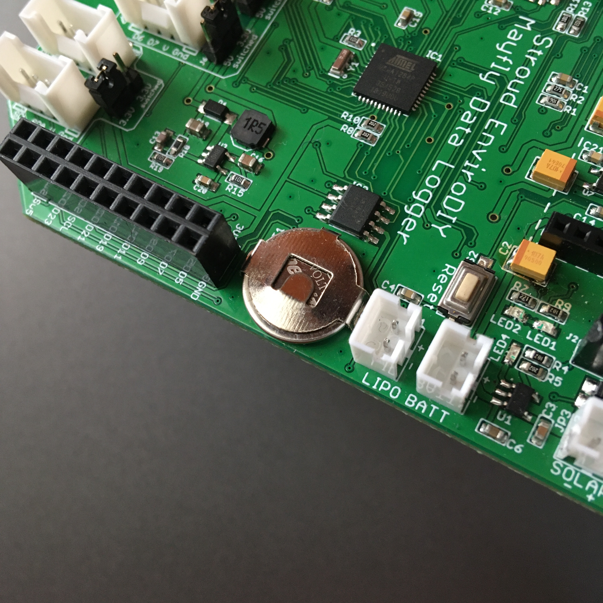  

You will need to install a CR1220 battery for the real-time clock on your Mayfly board by sliding it into the circular metal battery holder located on the board. Make sure that the orientation of the polarity (+ and -) is correct so the board is not damaged.  
  
### 3.7 Volt Lithium Polymer Battery  
  
If you plan to use your Mayfly while only attached to a computer, you will not need to have an external battery. You can simply power your Mayfly through the built in USB connection. 
  
If you plan to install your Mayfly out in the field, it is important to select a battery with enough storage capacity to operate for a period of time without being charged or with very little opportunity to charge). This is important for installation sites that are well shaded or receive partial sunlight during the day (forests, shaded slopes or valleys).  
  
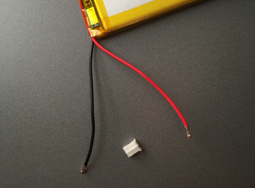  
  
The battery will need to have a 2 pin [JST-PH connector](https://www.google.com/search?rlz=1C1GCEU_enUS821US822&ei=REePXvuJIdmHytMP8_iH4AQ&q=JST-PH+connector&oq=JST-PH+connector&gs_lcp=CgZwc3ktYWIQAzICCAAyAggAMgYIABAWEB4yBggAEBYQHjIGCAAQFhAeMgYIABAWEB4yBggAEBYQHjIGCAAQFhAeMgYIABAWEB4yBggAEBYQHjoECAAQR0oOCBcSCjMtMTFnMTEtOTBKDAgYEggzLTJnMTEtMVDDhAZYw4QGYL-LBmgAcAJ4AIABU4gBU5IBATGYAQCgAQKgAQGqAQdnd3Mtd2l6&sclient=psy-ab&ved=0ahUKEwj7u9aJ3NvoAhXZg3IEHXP8AUwQ4dUDCAw&uact=5). This is a small (2mm) connector with a key or ridge on one side that mates with the connector on the Mayfly (see [Assembling the Mayfly Data Logger](https://www.envirodiy.org/mayfly-sensor-station-manual/#assembling-the-mayfly-data-logger)).   
  
**It is important to look at the polarity (positive & negative) of the wires coming from the battery in relation to the polarity on the Mayfly board.**  
  
  * Each battery connector on the Mayfly will have a `plus (+)` and `minus (-)` symbol printed on the circuit board.  
  * The battery will have two wires attached to the connector, a `positive (red)` and a `negative (black)`.  
  * These must match up when connecting the battery to the Mayfly `(red + & black -) `.  
  * If your battery does not match up you will need to change the wires in the connector so they do.  
  
  
  
**CONNECTING A BATTERY WITH INCORRECT POLARITY CAN BE HAZARDOUS TO YOUR WELL BEING AND TO THE MAYFLY**    
  
It is also a good measure to purchase some [additional JST connectors](https://www.digikey.com/catalog/en/partgroup/ph-series/8404). Having a few extra will help with changing the wiring on you Li-Po batteries if you received them with the polarity reversed. They are very fragile and will become loose fitting if care is not taken when disconnecting them from the wiring.  

### OneWire Temperature Sensor   
  
Seeed Studio offers a [OneWire temperature sensor](https://www.seeedstudio.com/One-Wire-Temperature-Sensor-p-1235.html) that comes complete with a Grove connector, making it very simple to connect and use the sensor with little to no modification.  The only downside to have a sensor pre-wired with a connector is routing it through the waterproof enclosure.  
  
You will also need a cable gland or silicone sealant if you plan to deploy your logger in the field.  
  
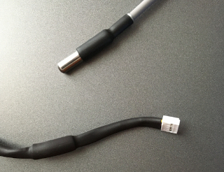  
  
### Additional Hardware  
  
The following items are helpful but not essential to the completion of the Mayfly setup:  
  
  * Micro-SD card - If you plan to deploy the logger in the field, you may want to buy an additional micro-SD card so that you can swap cards when retrieving your data.
  * Larger Solar Panel - [Voltaic Systems](https://voltaicsystems.com/solar-panels/) sells larger solar panels if you need more power for your logger.  This will also need to have a JST connector or an [adapter](https://voltaicsystems.com/3511-ext-jst/) to connect with the logger.
  * Cable Glands/Silicone Sealer - Needed to keep the sensor cable in place and to keep moisture from entering the enclosure.
  
### Putting it All Together  
  
Once you have gotten this far, you can start putting the pieces together to get an idea what your set up will look like.  

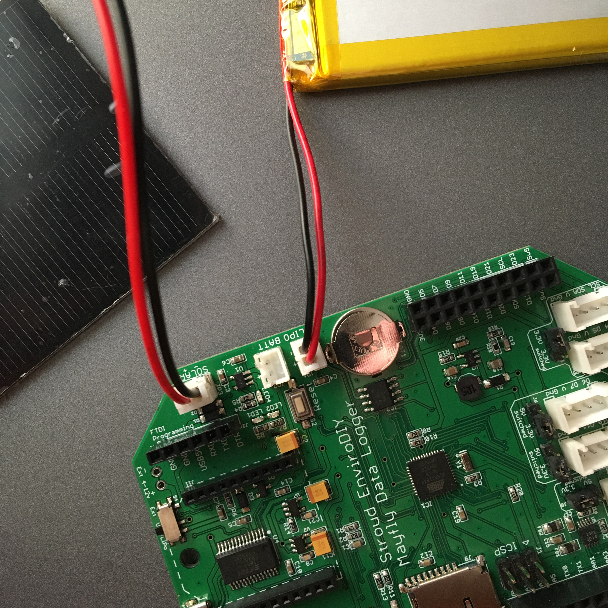  
  
  * Plug the Li-Po battery into the connector marked `LIPO BATTERY`. There are two of them and it does not matter which one you use. The second is for supplying additional power to the XBee cellular module, which is not used in this example.  
  * Plug the solar panel into the connector marked `SOLAR` on the Mayfly board.  
  * Plug the OneWire Temperature Sensor into the Grove connector marked `D4-5` on the Mayfly. 
  * Insert the micro-SD card into the slot provided or into the vertical SD card adapter.  
  
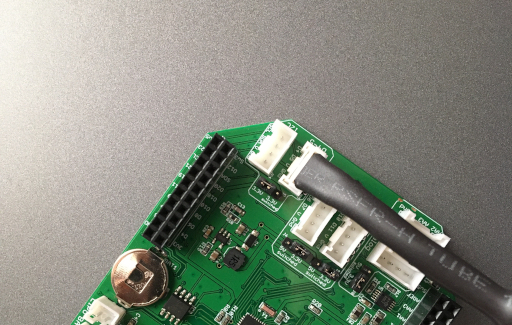  
  
These are the basic connections you will have to make when deploying your logger. If you are not using the Mayfly in a field location and only plan to have it connected to a computer, the solar panel and Li-Po battery will not be needed. 
  
<div style="page-break-after: always;"></div>  

## Setting up the Arduino Desktop IDE Software    
  
Use of the [Arduino Desktop IDE](https://www.arduino.cc/en/Main/Software) will be needed to compile and upload the [sketches](https://www.arduino.cc/en/Tutorial/Sketch) to the Mayfly. While the process is fairly straight-forward and all of the sketches are provided for you to use and modify, you may want to take some time to explore the [Arduino website](https://www.arduino.cc/) to better understand the concepts explained in this document.  
  
Detailed information on installing the Arduino software can be found on the Arduino website.  There is an [introduction](https://www.arduino.cc/en/Guide/Introduction) on what Arduino is and why you would want to use it as well as many other resources available to help you get started.

Here is also the link to the [EnviroDIY Mayfly Sensor Station Manual](https://www.envirodiy.org/mayfly-sensor-station-manual/#installing-arduino) for more information regarding the Arduino Desktop IDE.   
  
### Download the Arduino IDE
You will need to [download](https://www.arduino.cc/en/main/software) `version 1.6.5 or greater`. Please read the installation instructions for the corresponding operating system you are using:
  
  * [Windows](https://www.arduino.cc/en/Guide/Windows)  
  * [MacOS](https://www.arduino.cc/en/Guide/MacOSX)  
  * [Linux](https://www.arduino.cc/en/Guide/Linux)  

### Adding the EnviroDIY board to Arduino  

Before getting started in the section, you should have the following items ready:  
  
  * Arduino IDE software (installed)  
  * Mayfly board (clock battery installed) 
  * USB cable   

First, we need to add some information to the Arduino software to tell it a little about the specifics of the board we are using. Start the Arduino software, then click on `File > Preferences` and paste the following URL into the text box labeled `Additional Boards Manager URLs`:  

`https://raw.githubusercontent.com/EnviroDIY/Arduino_boards/master/package_EnviroDIY_index.json`   
  
Click the "`OK`" button to close this window and return to the main screen when finished.  
  
You will need to make the Mayfly the active board in the IDE  by going to `Tools > Board > Boards Manager` from the menu of the main screen. 
  
  * A new window will open and in the drop-down list on the top left of the screen `Type > Contributed`" and then type in  `EnviroDIY` In the search bar.
  * You should see a search result for the `EnviroDIY ATmega Boards`. Click the "`Install`" button to complete your selection and click the "`Close`" button when it has finished.   
    
  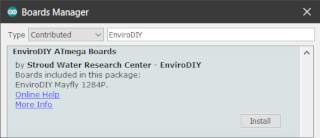  
  
  * Now, from the `Tools > Board` menu in the main window of the IDE, select the `EnviroDIY Mayfly 1284P` from the list of available boards.  

### Connecting to a Computer  
  
Additional instructions for connecting the Mayfly to your computer can be found in the [EnviroDIY Mayfly Sensor Station Manual](https://www.envirodiy.org/mayfly-sensor-station-manual/#connecting-a-computer-to-the-mayfly-data-logger).   
    
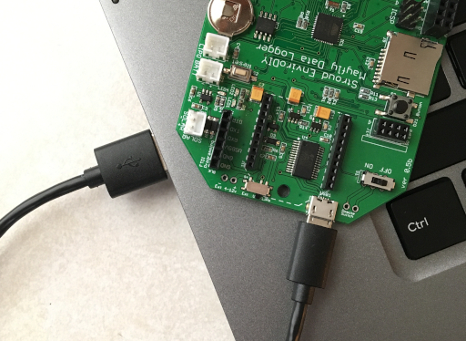  
 
  * Attach the USB cable to the Mayfly and to the computer.  
  * Turn on the Mayfly using the `off/on` switch.  
  * Select the `COM Port` in the Arduino software under the menu `Tools > Port`. You may have to wait a moment while your computer recognizes the new hardware.
  
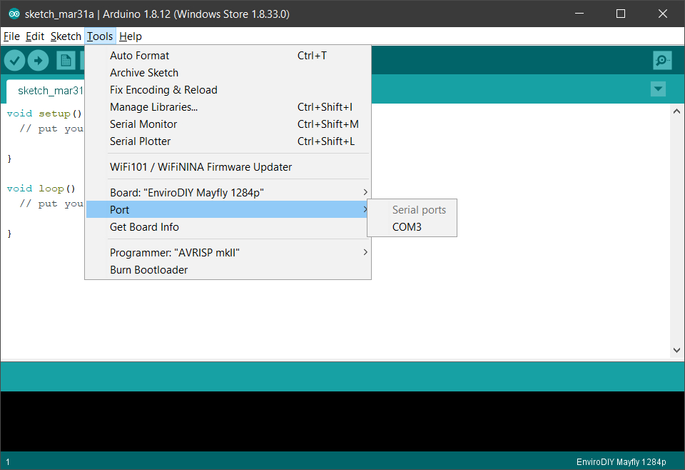  
  
Open the Serial Monitor to view the pre-loaded sketch that come with the Mayfly by pressing the `Serial Monitor` button, hold `Ctrl+Shift+M` or select `Tools > Serial Monitor` from the menu.  Make sure the "`baud`" rate option at the bottom right side of the window is set to "`57600`".
  
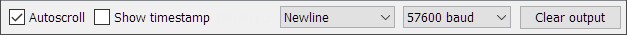  
  
<div style="page-break-after: always;"></div>  

## Compiling and Uploading Code  
  
This section will help you get your Mayfly set up for the temperature logging code that will run once the unit has been deployed in the field. These sketches are provided with the libraries that will be installed in each example.
  
### Setting the Date and Time on the Real-time clock    

One of the most important first steps that needs to be done is setting up the real-time clock (RTC) so that your time-stamps in your logger data are correct Make sure you have installed the clock battery before continuing with this section.  
  
In the Arduino software:  

  * Open up the Library Manager: `Tools > Manage Libraries`  
  * Type "`Sodaq_DS3231`" in the search bar   
  * Select the library named "`Sodaq_DS3231`"  
  * Click the "`Install`" button
  * Close this window when finished 
  
From the menu, select `File >  Examples > Sodaq_DS3231 > adjust` to open the example code from this library.  

Look at the following line of code in the `setup()` function. This is where the sketch sets the time:
  
`DateTime dt(2011, 11, 10, 15, 18, 0, 5);`   

This line of code translates to `year, month, date, hour, min, sec and week-day(starts from 0-Sunday and goes to 6-Saturday)`  
   
  * Change the time in this line of code to be a time in the near future (about a minute or two).  We will call this the "target time". 
  * Compile and upload the sketch, by clicking the `Upload` button, hold `Crtl+U` or select `Sketch > Upload` from the menu.   
  * Use a "reference" point like like [Time.gov](http://www.time.gov/) to view the current time.  When the reference is about 3 seconds from the "target time" we set in the code, press the `Reset` button on the Mayfly (this gives the Mayfly a few seconds to reset itself).  
  * Open the Serial Monitor by pressing the `Serial Monitor` button, hold `Ctrl+Shift+M` or select `Tools > Serial Monitor` from the menu.  Make sure the "`baud`" rate option at the bottom right side of the window is set to "`57600`".  
  
```   
2020/4/21 19:19:31
Tue
2020/4/21 19:19:32
Tue
2020/4/21 19:19:33
Tue
2020/4/21 19:19:34
Tue
2020/4/21 19:19:35
Tue
```  
  
  * The Serial Monitor should output the current date-time set on the Mayfly.  If you are unsatisfied with the results or you missed the reference time, change the "target time" (`DateTime dt()`) in the code, upload the sketch to the Mayfly and try again.  
  
At this point, the RTC is set but if you were to turn the Mayfly off and back on or press the `Reset` button a second time, the time would revert to the time we set in `rtc.SetDateTime(dt)`. We want to change that line of code so that the time is NOT SET AGAIN in the `setup()` function.  
  
Close the Serial Monitor and return to the line where we set the date-time (`rtc.setDateTime(dt); `).  Use two slashes in front of the line of code so it looks like the following:  
  
`//    rtc.setDateTime(dt); //Adjust date-time as defined 'dt' above`    

  * Compile and upload again by clicking the `Upload` button, hold `Crtl+U` or select `Sketch > Upload` from then menu.   
  * Open the Serial Monitor by pressing the `Serial Monitor` button, hold `Ctrl+Shift+M` or select `Tools > Serial Monitor` from the menu.  Make sure the "`baud`" rate option at the bottom right side of the window is set to "`57600`".  
  * The Serial Monitor should continue to output the correct date and time currently set on the real-time clock.  
  * When you are finished, you can close the Arduino window and select `No` when asked to save the file.  
  
### Testing the OneWire Temperature Sensor
  
If you purchased the Seeed Studio or similar OneWire temperature sensor, the following section will help you to verify that your sensor is functioning correctly.  

In the Arduino software:  

  * Open up the Library Manager: `Tools > Manage Libraries`  
  * Type "`DallasTemperature`" in the search bar   
  * Select the library named "`DallasTemperature`"  
  * Click the "`Install`" button
  * Close this window when finished   

Plug the OneWire Temperature Sensor into the Grove port marked `D4-5` on the Mayfly board.  
  
  * From the menu select `File > Examples > Dallas Temperature > tester`
  * Search for the line: `#define ONE_WIRE_BUS 2` in the code for the tester sketch.   
  * Change this line to: `#define ONE_WIRE_BUS 4`  
  * Upload the sketch to the Mayfly by clicking the `Upload` button, hold `Crtl+U` or select `Sketch > Upload` from the menu  
  * Open the Serial Monitor by pressing the `Serial Monitor` button, hold `Ctrl+Shift+M` or select `Tools > Serial Monitor` from the menu  
  * Make sure the "`baud`" rate option at the bottom right side of the window is set to "`9600`"  
  
```  
Requesting temperatures...DONE
Temperature for device: 0
Temp C: 18.00 Temp F: 64.40
Requesting temperatures...DONE
Temperature for device: 0
Temp C: 18.00 Temp F: 64.40
Requesting temperatures...DONE
Temperature for device: 0
Temp C: 18.00 Temp F: 64.40
Requesting temperatures...DONE
Temperature for device: 0
Temp C: 18.00 Temp F: 64.40
```  
The Serial Monitor should output the current temperature that the sensor is reading.  This is also helpful in conducting QC tests to determine how accurate your sensor is.  
  
**Extra Credit**  
The output from the Serial Monitor scrolls by pretty quick but if you are comfortable with with making some changes, you can insert a `delay();` statement in the code to slow it down.  
  
In the first line of the `loop()` function, right after the first opening brace `{`, insert the following line of code: `delay(500);`. This will make the sketch wait briefly before printing the next temperature reading and make it easier to read.
  
  * Upload the sketch to the Mayfly by clicking the `Upload` button, hold `Crtl+U` or select `Sketch > Upload` from the menu  
  * Open the Serial Monitor by pressing the `Serial Monitor` button, hold `Ctrl+Shift+M` or select `Tools > Serial Monitor` from the menu  
  * Make sure the "`baud`" rate option at the bottom right side of the window is set to "`9600`" 
  
When you are finished, you can close the Arduino window and select `No` when asked to save the file.   
  
### Continuous Temperature Logging Code  
  
Finally, this is the part where we get to the real world application of the Continuous Temperature Logger.  Make sure that you have followed the steps for setting the real-time clock and have inserted the micro-SD card into the slot provided.  
  
**NOTE:** While it may appear to be a lot more code and more complex, there is very little you will have to change to get this running. The hard part has been done and you only need to configure the data header if you plan to upload your data to MonitorMyWatershed.org.  
  
The sketch for the Continuous Temperature Logger is currently set up to cycle through the following operations at one minute intervals:  
  
  * Wake up the Mayfly board
  * Get the current temperature from the sensor
  * Read the current voltage of the battery
  * Read the current temperature of the Mayfly
  * Write the information to the SD card
  * Go back to sleep (to conserve power)
  
Go to GitHub and [download](https://github.com/movingplaid/Mayfly_ContinuousTemperatureLogger) the Continuous Temperature Logging code. There will be a button on the page to "Clone or Download" the repository. Click on "Download ZIP" and save the file to your computer.  
  
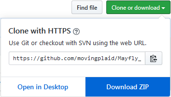  
  
You will need to extract these files to your computer before using them.  If you are unsure how do this, check this link for extracting files in [Windows 10](https://support.microsoft.com/en-us/help/14200/windows-compress-uncompress-zip-files).  If you are using something other than Windows (MacOS or Linux), the basic concept is the same.  You can do a quick Google search to find out more.  
  
Open the file (`Mayfly_ContinuousTemperatureLogger.ino`) in the Arduino IDE and search for the line of code that looks like this:  
  
```
// Data Header
#define   DATA_HEADER Sampling Feature UUID: v[sampling feature UUID],,,\r\nSensor Name:,Maxim_DS18B20,EnviroDIY_Mayfly Data Logger,EnviroDIY_Mayfly Data Logger\r\nVariable Name:,Temperature_C,Battery_Voltage,Board_Temp_C\r\nResult Unit:,degreeCelsius,volt,degreeCelsius\r\nResult UUID:,[variable 1 UUID],[variable 1 UUID],[variable 1 UUID]\r\nDate and Time in UTC-5,Temperature,Battery voltage,Temperature
```  

This is the header information for the values that will be written to the SD card.  For now, we will keep it as it is, but you will need to change the UUID codes in the braces `[ ]` when [adding your sensors](https://wikiwatershed.org/help/sensor-help/sharing-sensor-data/#sensor-data) to MonitorMyWatershed. 
 
If you do not plan to upload your data to MonitorMyWatershed.org, you can leave these values as they are, but the must stay in this order unless you make further changes to the sketch.    

The following libraries will need to be installed via the library manager found under `Tools > Manage Libraries`. 
  
  * OneWire 
  * Sodaq_DS3231  
  * Sodaq_PcInt
  * RTC_Timer  
  * DallasTemperature  
  
For each library you will need to do the following:  
  
  * In the Arduino IDE, go to `Tools > Manage Libraries` and type the name of the library in the search bar and press "`Enter`" on your keyboard.  
  * Select the library found and click the "`Install`" button.   
  * Click the `Close` button when you have finished installing all of the libraries.
  
If you want to change the interval that the Mayfly wakes up to record data, search for the following line (in the `loop()` function):  
  
`if(currentminute % 1 == 0) {`  
  
You can change `currentminute % 1` to whatever value suits your needs.  For testing purposes, it is convenient to have the time set low so you do not have to wait long for each reading.  In the field you may want to increase the time to 5 or 15 minutes, depending on how precise you want your data to be.  
  
  * Plug the OneWire Temperature Sensor into the Grove port marked `D4-5` on the Mayfly board.
  * Upload the sketch to the Mayfly by clicking the `Upload` button, hold `Crtl+U` or select `Sketch > Upload` from the menu.  
  * Open the Serial Monitor by pressing the `Serial Monitor` button, hold `Ctrl+Shift+M` or select `Tools > Serial Monitor` from the menu. Make sure the "`baud`" rate option at the bottom right side of the window is set to "`9600`". 
  
The logger will start off by printing the data header that will be written to the micro-SD card followed by an initial sensor reading. The time set above (`currentminute`) will dictate how often the logger will wake up and take an new reading.  
  
```
Power On, running: Temperature Logging

Sampling Feature UUID: [sampling feature UUID],,,
Sensor Name:,Maxim_DS18B20,EnviroDIY_Mayfly Data Logger,EnviroDIY_Mayfly Data Logger
Variable Name:,Temperature_C,Battery_Voltage,Board_Temp_C
Result Unit:,degreeCelsius,volt,degreeCelsius
Result UUID:,[variable 1 UUID],[variable 1 UUID],[variable 1 UUID]
Date and Time in UTC-5,Temperature,Battery voltage,Temperature

Initiating sensor reading and logging data to SDcard
----------------------------------------------------

Sensor temperature is: C: 18.00
Data Record: 2020-04-20 19:08:23,18.00,4.61,18.5

Initiating sensor reading and logging data to SDcard
----------------------------------------------------

Sensor temperature is: C: 18.00
Data Record: 2020-04-20 19:09:00,18.00,4.59,18.5
```

At this point you have set up your logger and you can begin to experiment with the temperature sensor, taking various reading or doing some initial quality control.
  
If your intent is to deploy the Mayfly in the field, continue on to the `Field Installation` section to set up a location and your MonitorMyWatershed information.
  
<div style="page-break-after: always;"></div>   

## Quality Control  
  
The Maxim DS18B20 sensor chip that is used in the OneWire temperature sensor has the following specifications:
  
```  
Power Supply		3V to 5.5V  
Current Consumption	1mA  
Temperature Range	-55 to 125°C  
Accuracy		±0.5°C    
```  
  
We can see that the sensor has an accuracy of ±0.5°C so that is the acceptable difference in readings we are looking at. The chart below lists the QC readings taken from March 24th through April 25th.  
  
```  
Date		Logger	Therm	Diff	Time
------------------------------------------------
3/24/2020	9.75	10.40	0.65	16:08:00  
3/26/2020	10.75	11.10	0.35	17:09:00  
3/29/2020	8.75	9.00	0.25	12:20:00  
4/1/2020	10.75	10.90	0.15	14:08:00  
4/6/2020	13.25	14.70	1.45	17:15:00    
4/10/2020	8.75	8.80	0.05	11:30:00  
4/12/2020	9.00	8.90	0.05	11:45:00  
4/16/2020	10.25	9.80	0.45	17:16:00  
4/20/2020	12.25	12.20	0.05	17:06:00  
4/25/2020	11.75	11.70	0.05	11:45:00
```  
  
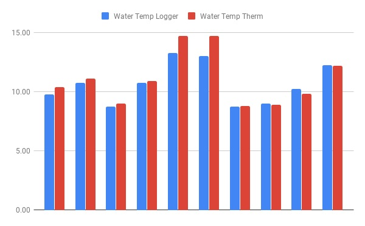  
  
With the exception of the reading on April 6th, the majority of the readings are within the acceptable range.  There was an issue with the battery connector on that date and the battery needed to be swapped out. This may or may not have had an effect on the data.   

These QC checks were done using a digital thermometer close to the sensor on the station as possible. It also helps to try and time your measurement to the same time as the loggers sampling time (i.e. 15 minute or whatever time interval you set in your code) to get an accurate  comparison.  

By performing a QC check every time the logger is visited or each time the SD card is changed, a clearer record of the accuracy of the sensor can be obtained.  

<div style="page-break-after: always;"></div>  

## MonitorMyWatershed 
  
This section will briefly cover some of the basic tasks you will need to do in order to get your data to the MonitorMyWatershed data portal.  For more in-depth information, you should read through the [Monitor My Watershed Sensor Data Manual](https://wikiwatershed.org/help/sensor-help/sharing-sensor-data/).  
  
Getting started with MonitorMyWatershed is (almost) as easy as one-two-three.  
  
  * [Create a new account](https://wikiwatershed.org/help/sensor-help/sharing-sensor-data/#create-an-account-2)  
  * [Register a site](https://wikiwatershed.org/help/sensor-help/sharing-sensor-data/#add-a-site-2)  
  * [Add your sensors](https://wikiwatershed.org/help/sensor-help/sharing-sensor-data/#sensor-data)  
  * [Upload your data](https://wikiwatershed.org/help/sensor-help/sharing-sensor-data/#sensor-data)  
  * [View your data](https://wikiwatershed.org/help/sensor-help/sharing-sensor-data/#site-data)
  
### Creating an account  
  
The very first step to getting your data on-line is to [register](https://monitormywatershed.org/register/) a new account.  Like many other websites, some basic information is required to sign up:
  
  * First name  
  * Last name  
  * Email address  
  * Username  
  * Password  
  * Organization (optional)  
  
Once you have enter this information, you can proceed to the next section to register your site.    
  
### Registering a Site 
  
Once you have logged in, click on `My Sites` at the top of the page. This will open a new page where you can register a new site or display the sites you have already created.   
  
  
  
Click the button on this page that reads `Register a New Site` and a page will open where you can enter the physical information about your site such as location and type.  
  
### Adding Sensors 
  
Once your site is set up, you can proceed to adding sensor information.  Look for the button `MANAGE SENSORS` on your site page and click on it.  
  
  
  
The page will open to show which sensors have been added to the site. If this is a new site there will be no sensors listed. This example shows the list for the logger on Stillwater Run.  
  
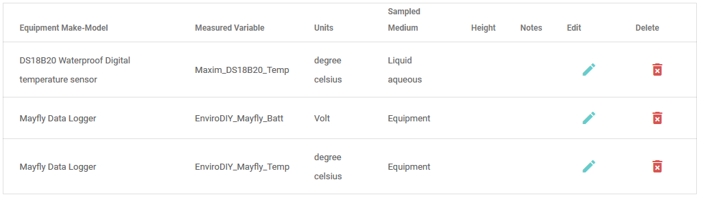  
  
It is important to note that anything you want to record and display data for is considered a sensor. Even the Mayfly and the battery are sensors in this context.  
  
Click on the plus sign `+` to create a new sensor entry and fill out the required fields for each sensor you wish to add. If you are building a duplicate of the logger used in the document, you should have a total of three when you are finished:  
  
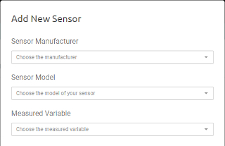  
  
  * DS18B20 Waterproof Digital temperature sensor (Maxim_DS18B20_Temp)  
  * Mayfly Data Logger (EnviroDIY_Mayfly_Batt)  
  * Mayfly Data Logger (EnviroDIY_Mayfly_Temp)  
    
You will also need to [edit the header information](https://wikiwatershed.org/help/sensor-help/sharing-sensor-data/#sensor-data) (DATA_HEADER) in the Continuous Temperature Logger code to match your individual site (or manually do it after retrieving your data from the logger.   
  
For reference, here is the [Stroud Example File](https://wikiwatershed.org/wp-content/uploads/example-file-for-upload.csv) which shows the basic format.  
  
In the code for the Continuous Data Logger, find the following line:   
  
```
// Data Header
#define   DATA_HEADER Sampling Feature UUID: v[sampling feature UUID],,,\r\nSensor Name:,Maxim_DS18B20,EnviroDIY_Mayfly Data Logger,EnviroDIY_Mayfly Data Logger\r\nVariable Name:,Temperature_C,Battery_Voltage,Board_Temp_C\r\nResult Unit:,degreeCelsius,volt,degreeCelsius\r\nResult UUID:,[variable 1 UUID],[variable 1 UUID],[variable 1 UUID]\r\nDate and Time in UTC-5,Temperature,Battery voltage,Temperature
```   
  
This data header provides you with a template for formatting your data to be usable with MonitorMyWatershed.  You will need to replace the entries between the braces `[ ]` with the values that your are given with your sensor setup.  
  
Go to your site on MonitorMyWatershed.org. At the top, next to the map, you will find the `Sampling Feature UUID`. Paste this code into your data header.  
  
Next, click on `Manage Sensors`, choose the sensor you want to find the UUID for and click `Edit`. At the top of the window that opens, your UUID for the sensor will appear. This is the ID you will need to paste into the data header for the continuous Temperature Logging code.  
  
  

Do the same for all of your sensors that you have added.  
  
If you decide to add more sensors in the future, you will need to edit your header to match the new data you are sampling.  
  
### Uploading Data  
  
Once you have collected some data and are ready to upload it to MonitorMyWatershed, return to your site page and click the `MANAGE SENSORS` button. Look for the paper clip icon in the `Upload a data file (.csv)` section and click on it.  
  
  
  
From here you can select your data file and then click the `Upload` button.  If you formatted your data correctly you should receive an `Data was uploaded successfully` message.  
  
  
  
### Viewing Your Data  
  
Once you have uploaded your first batch of data, you can view it by simply going to your site page. For an expanded view, you can look at the Time Series Analysis for each or all of the sensors at once.  Click the link to read more about [View Site Data](https://wikiwatershed.org/help/sensor-help/sharing-sensor-data/#view-site-data).  
  
<div style="page-break-after: always;"></div>  

## Field Installation  
  
This section will guide you through some of the tasks you will need to perform in order to set up your Mayfly in the field. Because this was a low cost experiment using as few components as needed and paying attention to overall cost, some of this information has been altered from the methods used in the [EnviroDIY Sensor Station Manual](https://www.envirodiy.org/mayfly-sensor-station-manual/#installation-steps), but feel free to experiment or come up with solutions that work best for your situation and location.  

### Location  
  
Ideally, you would like an open [location](https://www.envirodiy.org/mayfly-sensor-station-manual/#choosing-an-installation-location) that receives plenty of sunlight and is also close to the water source you wish to monitor.  Remember that your sensor cable is limited in its length and so, your sensor should be close to the water while still being positioned in a stable location.  
  
The height of the mounting device you choose will also determine how close to the source you will have to be and still have enough sensor cable to reach it.  

### Mounting Hardware and Installation 

Some basic hardware and preparation will be required to install your logger in the field:  
  
**Hardware:** 
  
  * Mounting pole for the data logger and enclosure (Many hardware stores sell an inexpensive [fence post](https://www.lowes.com/pd/Blue-Hawk-Common-3-1-2-in-x-5-ft-Actual-0-6-in-x-3-5-in-x-5-ft-Powder-Coated-Steel-Garden-Fence-U-post-Post/4780965) that works well).  
  * [Tie wraps](https://www.lowes.com/pd/Utilitech-20-Pack-8-in-Cable-Ties/50005720) to secure any slack on the sensor cable. 
  * [Landscaping pins](https://www.lowes.com/pd/Jobe-s-25-Pack-3-1-2-in-Steel-Landscape-Fabric-Pins/3638366) to hold down the sensor cable leading from the pole to the water.  
  * 3' or 4' [Rebar stake](https://www.lowes.com/pd/Hillman-1-2-in-dia-x-3-ft-L-Plain-Hot-Rolled-Steel-Weldable-Rebar-Rod/3057575) for sensor support in the water.  
  * [PVC pipe](https://www.lowes.com/pd/Charlotte-Pipe-1-in-dia-x-2-ft-L-450-PSI-PVC-Pipe/3341536) to protect the sensor installation.  
  * Nuts, bolts, washers and any other hardware to mount the logger to the mounting pole (This example uses 1/4" hardware).   
  
**Preparation:**

  * You will need to drill at least two holes in the enclosure provided with the Mayfly Starter Kit: One for mounting to the pole you choose and one for the sensor to exit the enclosure.  
  * Place one rubber washer on the bolt and insert it into the hole for the mounting pole. Secure it with a washer and a nut for mounting later.
      
  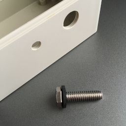 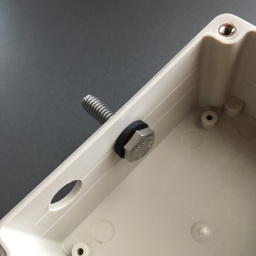  
  
  * Place the strain relief around the senor cable, close it and then insert it into the hole for the sensor.  You will also need to apply some silicone sealant or plumbers putty around the relief to keep it waterproof once it is assembled in the case.  
    
  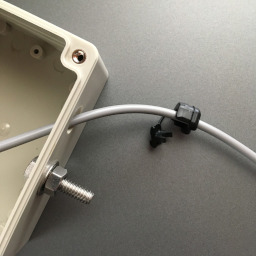   
     
  * If you have the skill or experience, you can also use a cable gland in place of the strain relief but you will need to remove the Grove connector before running the cable though the gland.  
    
  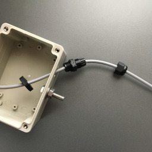   
      
  * Place the Mayfly into the enclosure. You may need to angle it slightly to clear the bolt and strain relief. Use the screws provided with the kit to secure the board in the enclosure (strain relief shown without sensor cable for clarity).  

  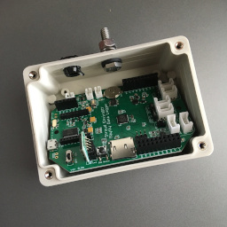 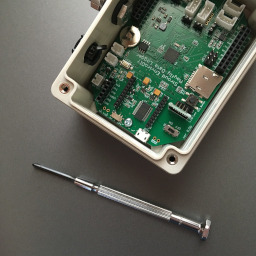  
    
  **Tools:**  
    
  * A hammer or mallet to drive the mounting pole into the ground at your chosen location.  A block of wood is also useful so that the mounting pole does not get damaged when hammering.
  * You will also need the hammer or mallet to drive the rebar stake into the stream for your sensor mounting.  
  * Wire cutters or scissors, if you plan to trim the ties wraps after securing the sensor cable.
  * A saw for cutting the PVC pipe, if you choose to use it. For the example installation, a section of PVC (1" diameter) was cut to 10". This slides over the rebar and sensor cable to protect it from debris that might run into it and snag the cable. Additional holes (1/8") were drilled into the PVC to allow securing it with tie wraps.
    
**Installation:**  
  
  * Drive the mounting pole into the ground with the hammer or mallet at the desired location.
  * Drive the rebar stake into the stream at the desired location.
  * Secure the enclosure for the Mayfly to the mounting pole. This image shows the cable routed through the bottom of the case instead of the side but getting the Mayfly in or out of the enclosure is difficult.
  * Plug in your battery, solar panel and sensor cable (the image shows a reflective insert to help reduce the effects of heating in the enclosure).
    
  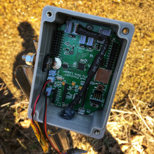  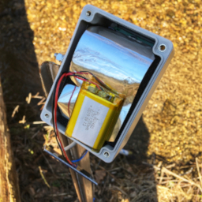
    
  * Run the sensor cable down the length of the mounting pole and through the piece of cut PVC pipe. Make sure you have enough cable and some slack to reach the rebar stake in the stream and to secure the cable to the ground.
    
  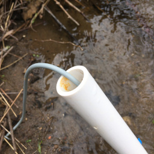  
    
  * Slide the PVC with the sensor cable inside, over the rebar stake in the stream.  
    
  * Set your sensor height in the water and secure it near the end with a tie wrap. If you leave a little extra tie wrap hanging out (not cut flush) the PVC pipe can rest on top of this and it will not slide down cover the tip of the sensor.  
  
  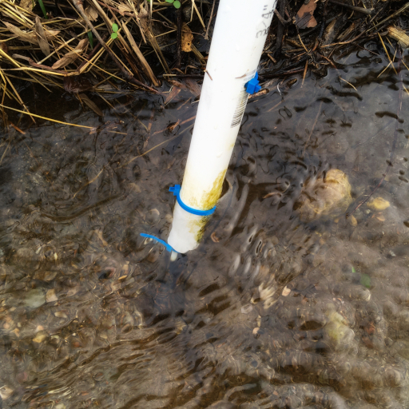  
    
  * Use additional tie wraps to secure the PVC pipe to the rebar stake using the 1/8" holes drilled previously.  
  * Secure the sensor cable to the mounting pole with tie wraps. 
  
    
    
  * Use the landscaping pins to secure the length of sensor cable running from the mounting pole to the water's edge.  
  
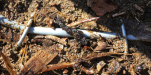    
  
When you have finished setting up your site, don't forget to insert the SD card, turn the Mayfly on, and secure the lid on the enclosure.  
  
<div style="page-break-after: always;"></div>  

## Conclusion  
  
Now all you have to do is wait until some data is collected.  How long you wait is up to you but it is a good first step to check on your setup frequently at the beginning to ensure that you are collecting data and that everything is functioning properly:  
  
  * Is the battery charging properly?
  * Is your sensor cable secure?
  * Have there been storms recently that may cause damage or instability to your setup?
  * Are animals chewing on your cables?
  * Did you turn your Mayfly on?
  * Is your micro-SD card inserted?
  * Did you do a QC check?
  
Once you have some time under your belt, you can think about ways to improve your current installation or what you can do better on your next one.  
  
  * Maybe you want a more powerful solar panel? The 0.5W panel with the Starter Kit could be a little more powerful, especially if you are in an area that doesn't receive a lot of direct sunlight.
  * How about a longer cable?  Some quick Internet searching might give you some ideas for building your own custom temperature cable.
  * Or you might want to experiment with networking your sensor station with other stations close by. There are inexpensive XBee modules that utilize WiFi to talk to each other.  
  
The [EnviroDIY](https://www.envirodiy.org/) website is also a great place to start getting ideas and reaching out to other users for help and inspiration.  Or, you can look at the [EnviroDIY GitHub](https://github.com/EnviroDIY) site for coding examples and learn how to use [VSCode](https://code.visualstudio.com/) and [PlatformIO](https://platformio.org/). 
  
Hopefully this document has set you on the right path for setting up your own sensor station or just for getting familiar with the EnviroDIY Mayfly. If you feel something could be improved upon, made clearer or is a downright error, please feel free to comment and help make it better for the next reader.
  
Happy Logging,   
Robert S  
  
<div style="page-break-after: always;"></div>  


